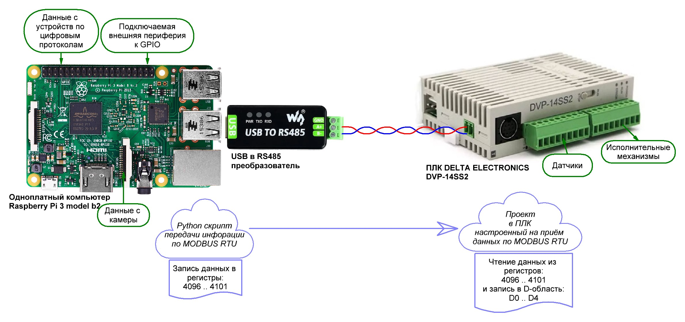
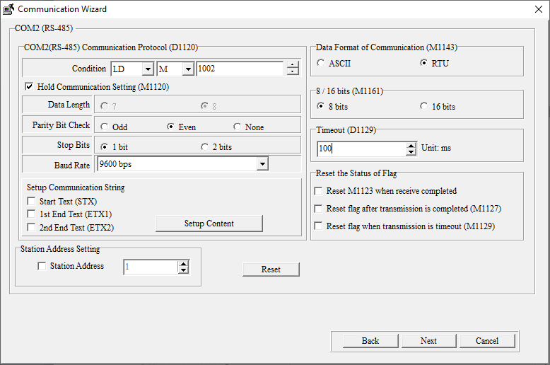
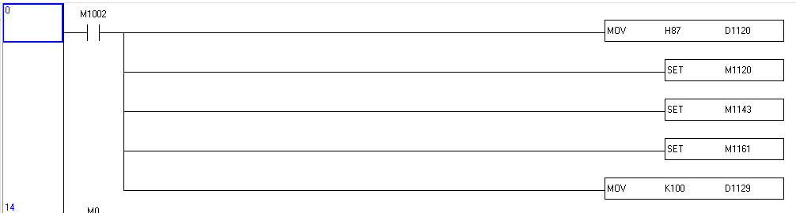
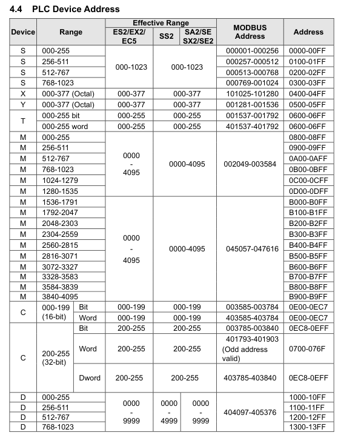

## 0. Постановка задачи

Расширяем возможности по автоматизации технологических установок путем передачи данных от одноплатного компьютера (Raspberry Pi) к ПЛК (Delta Electronics DVP-SS2) через Modbus RTU.



## 1. Реализация программы коммуникации для ПЛК

Настройки ПЛК для коммуникации по Modbus RTU.

Для примера выбран интерфейс WPLSoft, доступный в меню **Wizzard -> Program Example Generator -> Communication Programm**



В коде программы это будет выглядеть так:



## 2. Где находятся адреса регистров в которые будут попадать данные?

В документации на ПЛК



## 3. Реализация программы Raspberry Pi

Будем записывать случайные значения в регистры 4096-4100 с интервалом 2 секунды. Регистры 4096-4100 соответсвтуют D0-D4 (см. картинку выше)

### 3.1 Какие библиотеки использовать? 

Для промышленных решений: `PyModbus (синхронный) + asyncio для сложных задач`
Для быстрого прототипирования: `MinimalModbus`

Выбираем **PyModbus** если:
 - Нужна полная реализация протокола Modbus;
 - Требуется поддержка TCP и других расширенных функций;
 - Планируется масштабирование проекта;
 - Необходима асинхронная работа.

Установка **PyModbus**:
```bash
pip install pymodbus
```

### 3.2 Что делает скрипт?


## Дополнительно
## A. Проверка передачи данных по MODBUS RTU от ПК к ПЛК


## B. Проект программы для ПЛК в ISPSoft


## C. Видео демонстрация стенда

