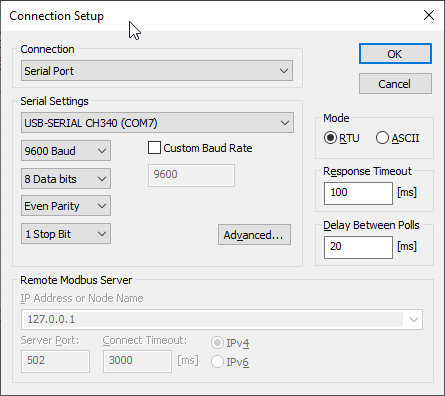
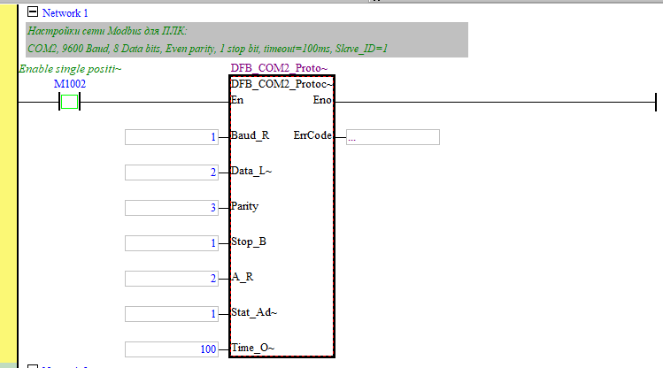

## 0. Постановка задачи

Расширить возможности по автоматизации технологических установок путем передачи данных от одноплатного компьютера (Raspberry Pi) к ПЛК (Delta Electronics DVP-SS2) через Modbus RTU.


Например, требуется получить информацию о температурах объекта, а покупать модуль расширения для ПЛК невыгодно. Также хотелось бы узнать, а какая погода будет через час и оповестить об этом ПЛК. На помощь приходить Raspberry Pi (или любой другой одноплатник): по 1-wire подключаем датчики ds18b20, опрашиваем API любимого сайта или же просто в наглую парсим его, встраиваемся в какое-то устройство по внутренним шинам данных - I2C, UART. Так или иначе если информация попала в Raspberry - то мы легко её передадим в ПЛК для работы автоматики.

## 1. Схема: условная, но не принципиальная


## 2. Реализация программы коммуникации для ПЛК

Проект программы для ПЛК (в WPLSoft) в файле: `modbus_slave.dvp`

Настройки ПЛК для коммуникации по Modbus RTU.

Для примера выбран интерфейс WPLSoft, доступный в меню **Wizzard -> Program Example Generator -> Communication Programm**


В коде программы это будет выглядеть так:


## 3. Где находятся адреса регистров в которые будут попадать данные?

В документации на ПЛК


## 4. Реализация программы Raspberry Pi

Будем записывать случайные значения в регистры 4096-4100 с интервалом 2 секунды. Регистры 4096-4100 соответсвтуют D0-D4 (см. картинку выше)

### 4.1 Какие библиотеки использовать? 

Для промышленных решений: `PyModbus (синхронный) + asyncio для сложных задач`

Для быстрого прототипирования: `MinimalModbus`

Выбираем **PyModbus** если:
 - Нужна полная реализация протокола Modbus;
 - Требуется поддержка TCP и других расширенных функций;
 - Планируется масштабирование проекта;
 - Необходима асинхронная работа.

Установка **PyModbus**:
```bash
pip install pymodbus
```

Установка **MinimalModbus**:
```bash
pip install minimalmodbus
```

### 4.2 Что делает скрипт?

Скрипт `ds18b20_modbus.py` опрашивает датчики DS18B20 каждые 5 секунд и полученное от них значение температуры в градусах Цельсия отправляет по Modbus RTU в ПЛК.


Скрипт использует библиотеку **MinimalModbus**

**Запуск скрипта:**

```bash
python ds18b20_modbus.py
```

Замечания:
 - Поскольку мы используем преобразователь USB в RS485 то порт Modbus будет `/dev/ttyUSB0`
 - Температура передается как целое число, умноженное на **10** (для сохранения одного знака после запятой);
 - Все операции логируются в файл `temperature_monitor.log`

## Дополнительно
## A. Проверка передачи данных по MODBUS RTU от ПК к ПЛК

Подключить преобразователь USB/RS485 и настроить связь (параметры такие же как и в проекте ПЛК). Если обмен пакетами не просиходит - переверни **A** и **B**.

Для теста связи я использую **Modbus Poll**, для других приложений - аналогично



Ссылка на видео: [тыц](https://youtu.be/NhkNWfFOJ8U)

## B. Проект программы для ПЛК в ISPSoft

Проект программы для ПЛК (в ISPSoft) в архиве: `modbus_ISPSoft 3.19.zip`



## C. Видео демонстрация стенда

Ссылка на видео: [тыц](https://youtu.be/NhkNWfFOJ8U)
